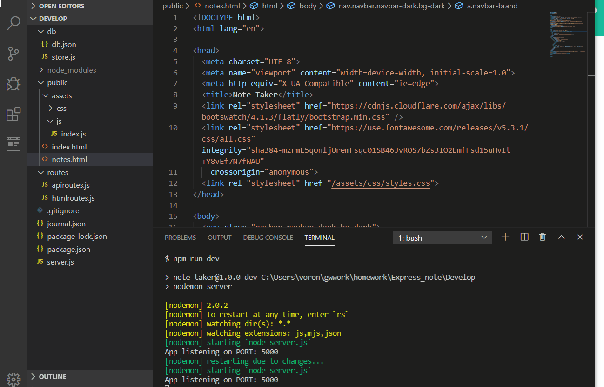

# Express_note-app

Express_note app helps to track notes. Upon start up user is prompted to write Note title and note itself. Note gets saved by a Express_note_app. User is able to look at all of the notes later. If note is no longer needed it can be deleted by pressing a delete icon.

Express_note_app works using node express package. Notes are accessed by doing a API call to a server. TO make this app work developer had to set up routes that allowed user to look at all of the saved notes, save new notes and delete existing notes.

